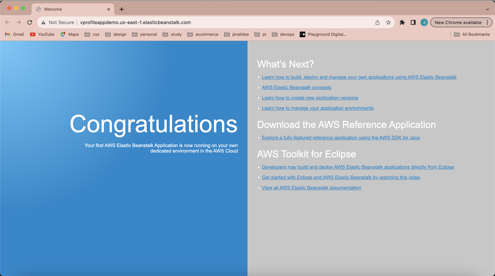
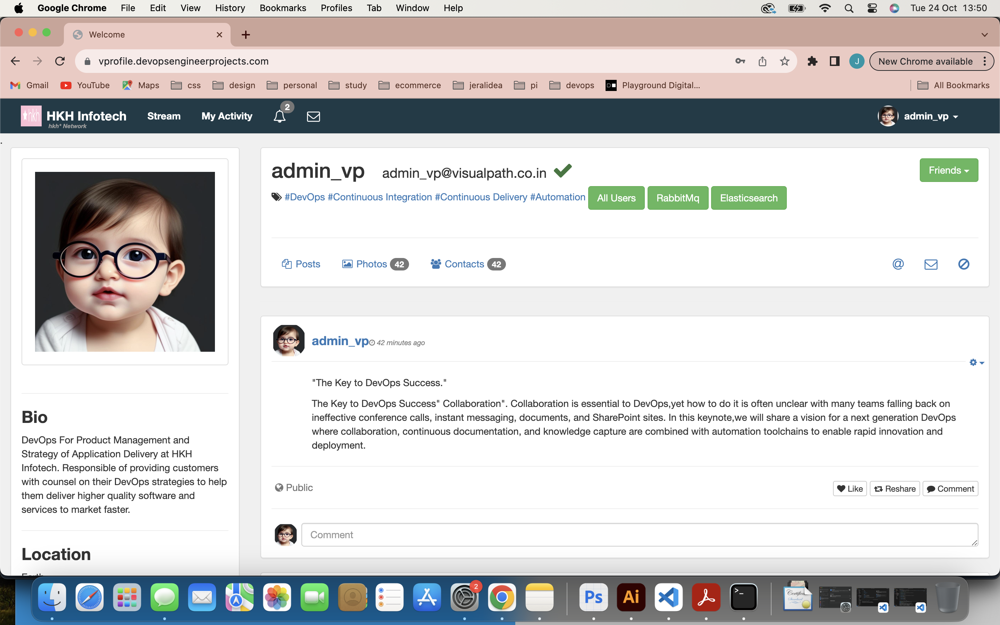
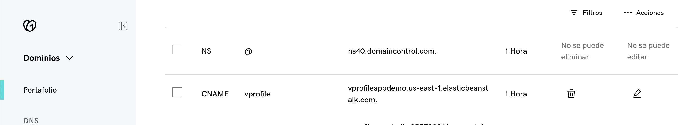
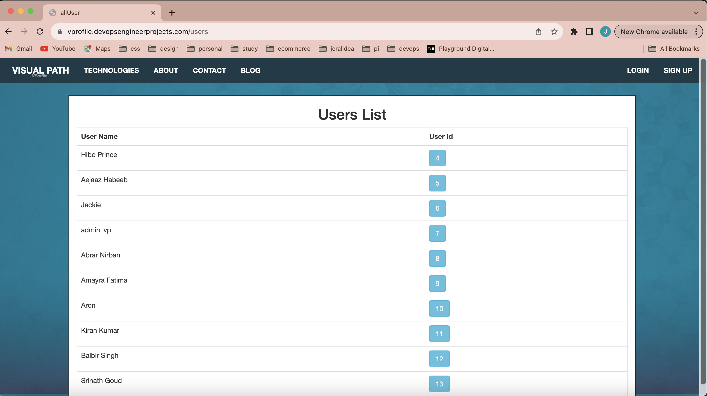
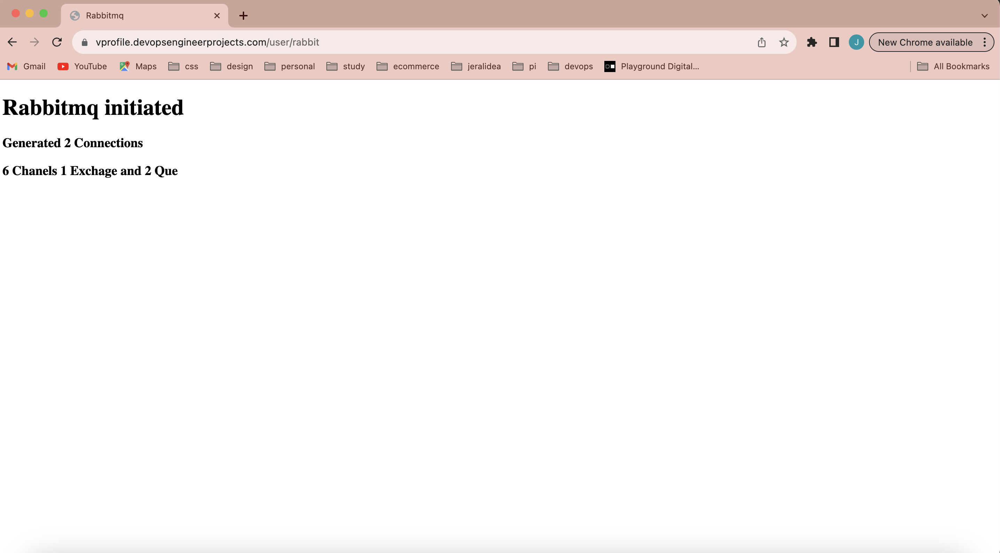
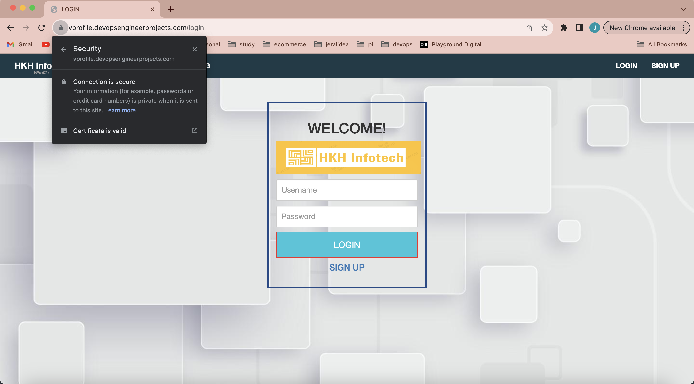

# Building my DevOps Portfolio 🚀

## Project 3: Rearchitecting Web App on AWS Cloud

As an employee at EY, I had the privilege of access to Udemy for Business. I decided to further enhance my DevOps skills by enrolling in the "DevOps Projects | 20 Real-Time DevOps Projects" course, and I'm sharing my journey for educational purposes.

### About

- ✅ Previous project: Multi-Tier web application stack (VProfile).
- ✅ Re-Architect Services on AWS Cloud.
- ✅ Architecture aimed at boosting agility and improving business continuity.

### Scenario

- 👩🏽‍💻 Project services running on Physical/Virtual/Cloud machines.
- 👩🏽‍💻 A variety of services that power your project runtime.
- 👩🏽‍💻 Multiple teams working around the cloud: Cloud computing team, Virtualization team, Data Center team, Operations team, Monitoring team, and Sysadmin team involved.

### Problem

- ❌ Operational Overhead.
- ❌ Struggling with Uptime and Scaling.
- ❌ Upfront CapEx and Regular OpEx.
- ❌ Manual Process.
- ❌ Difficult to automate.

### Solution

- ✅ To have a Cloud computing setup based on PaaS or SaaS.
- ✅ Pay as you go.
- ✅ Infrastructure as Code (IaC).
- ✅ Flexibility.
- ✅ Ease of Infra management.
- ✅ Automation to avoid human errors.

### AWS Services

- ☁️ Beanstalk: VM for Tomcat (App server).
- ☁️ Beanstalk: Nginx LB Replacement.
- ☁️ S3/EFS: Storage.
- ☁️ RDS Instance: Databases.
- ☁️ Elastic Cache: Memcached.
- ☁️ Active MQ: RabbitMQ.
- ☁️ Route 53: DNS.
- ☁️ Cloudfront: Content Delivery Network.

### Objective

- 🎯 Flexible infrastructure.
- 🎯 No upfront cost.
- 🎯 Infrastructure as Code (IaC).
- 🎯 Platform as a Service (PaaS).
- 🎯 Software as a Service (SaaS).
- 🎯 To simplify infrastructure management and reduce operational overhead.

## Comparison with AWS/Infra used on previous projects

| Current Infra   | Previous Infra  |
|-----------------|-----------------|
| Beanstalk       | Tomcat EC2/VM   |
| ELB in Beanstalk| Nginx LB/ELB    |
| Autoscaling     | None / Autoscaling |
| EFS/S3          | NFS / S3 / EFS  |
| RDS             | MySQL on VM/EC2 |
| Elastic Cache   | Memcached on VM/EC2 |
| Active MQ       | RabbitMQ on VM/EC2 |
| Route53         | GoDaddy, Local DNS |
| Cloudfront      | None / Multi DC Across world |

### Flow of Execution

1. ⏭️ Login to AWS Account.
2. ⏭️ Create key pair for Beanstalk instance login.
3. ⏭️ Create a security group for Elasticache, RDS, and ActiveMQ.
4. ⏭️ Create RDS, Amazon Elastic Cache, and Amazon Active MQ.
5. ⏭️ Create an Elastic Beanstalk Environment.
6. ⏭️ Update the security group of the backend to allow traffic from the Bean SG.
7. ⏭️ Update the security group of the backend to allow internal traffic.
8. ⏭️ Launch an EC2 Instance for DB initialization.
9. ⏭️ Log in to the instance and initialize the RDS DB.
10. ⏭️ Change the health check on Beanstalk to login.
11. ⏭️ Add a 443 https Listener to ELB.
12. ⏭️ Build an artifact with backend information.
13. ⏭️ Deploy the artifact to Beanstalk.
14. ⏭️ Create a CDN with an SSL certificate.
15. ⏭️ Update the entry in GoDaddy DNS Zones.
16. ⏭️ Test the URL.

### Repository

GitHub Repository: [vprofile-project-3](https://github.com/jeraldinnemg/vprofile-project-3)

Udemy Course: [DevOps Projects | 20 Real-Time DevOps Projects](https://www.udemy.com/course/devopsprojects/)

## Automated Provisioning of the infrastructure evidence.

# Prerequisites
#
- JDK 11 
- Maven 3 
- MySQL 8

# Technologies 
- Spring MVC
- Spring Security
- Spring Data JPA
- Maven
- JSP
- Tomcat
- MySQL
- Memcached
- Rabbitmq
- ElasticSearch
# Database
Here,we used Mysql DB 
sql dump file:
- /src/main/resources/db_backup.sql
- db_backup.sql file is a mysql dump file.we have to import this dump to mysql db server
- > mysql -u <user_name> -p accounts < db_backup.sql

